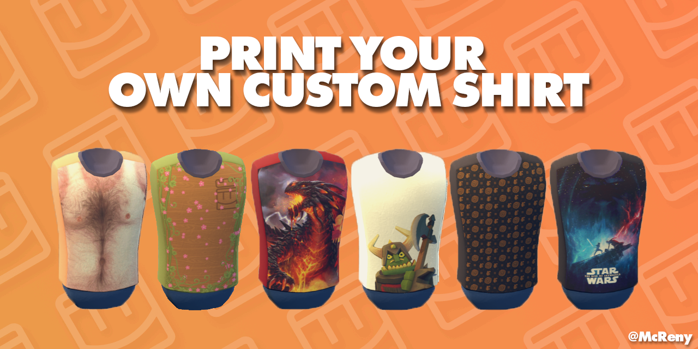
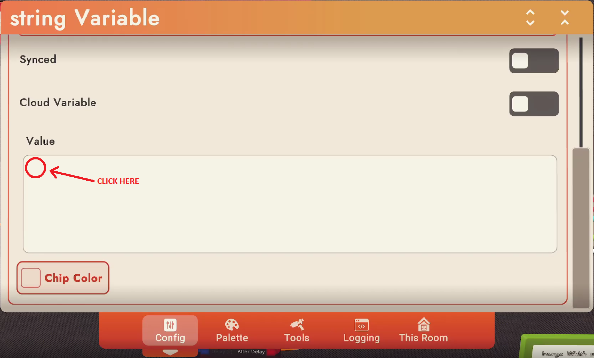
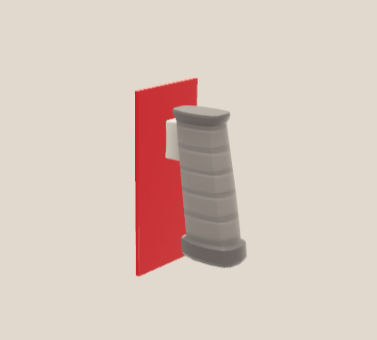
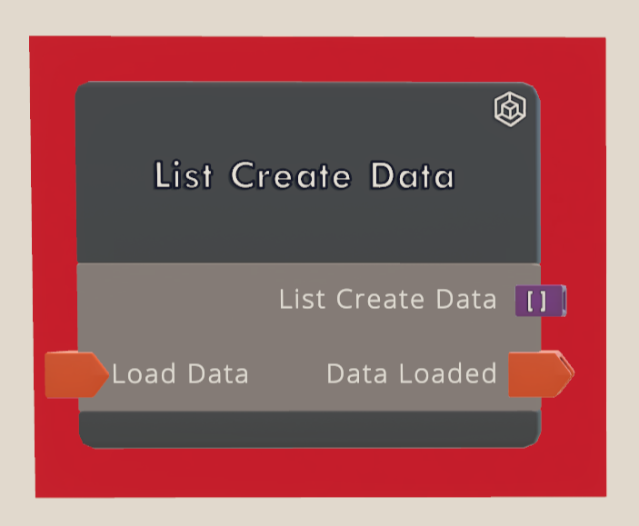
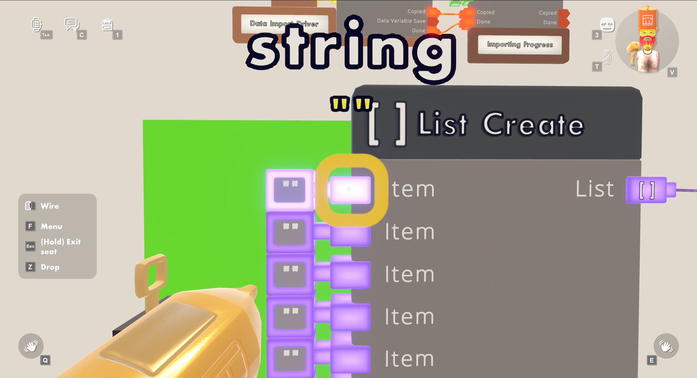
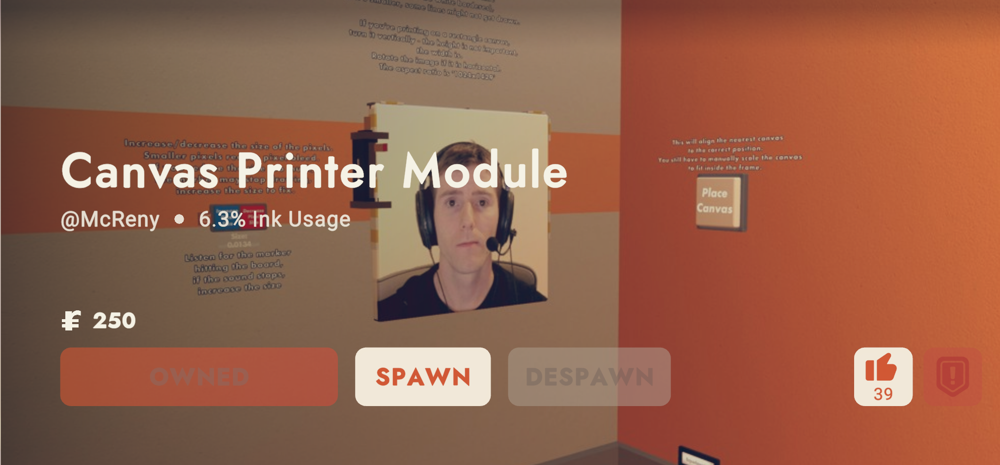
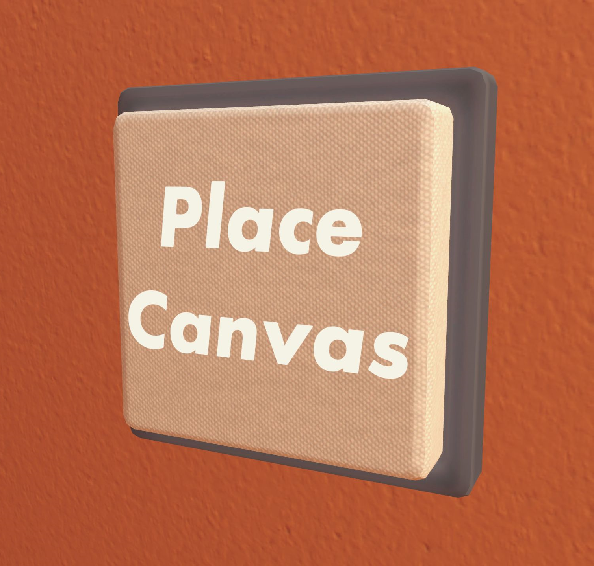
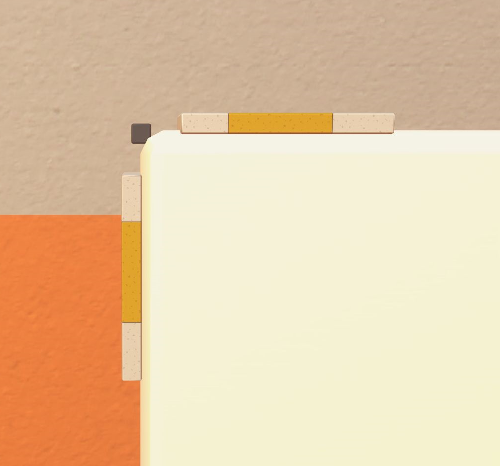
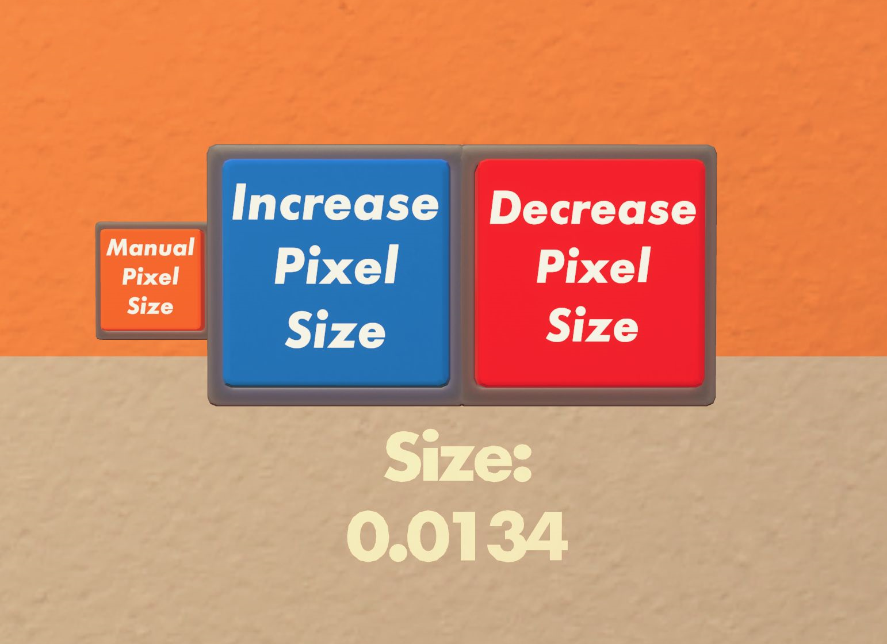

----

# Table of Contents
* [About this release](#about-this-release)
* [Video Tutorial](#video-tutorial)
* [Shirt Printer](#shirt-printer)
* [Getting the right coordinates for importing](#getting-the-right-coordinates-for-importing)
    * [Prepare for successful calibration](#prepare-for-successful-calibration)
* [The Invention](#the-invention)
    * [Optional modules/add-ons](#optional-modulesadd-ons)
    * [Spawning the invention](#spawning-the-invention)
* [Running the script](#running-the-script)
* [Importing](#importing)
    * [Importing using ***List Create*** (*recommended*)](#importing-using-list-create)
        * [Connecting List Create Data](#connecting-list-create-data)
    * [Importing using ***String Variable***](#importing-using-string-variable)
* [Spawning the shirt customizer](#spawning-the-shirt-customizer)
    * [Alternative method of placing the shirt customizer](#alternative-method-of-placing-the-shirt-customizer)
* [Adjusting printer settings](#adjusting-printer-settings)
* [Printing on a canvas](#printing-on-a-canvas)
    * [Invention](#invention)
    * [Placing a new canvas](#placing-a-new-canvas)
    * [Pixel Size](#pixel-size)
    * [Board settings](#board-settings)
* [Printing with custom colors](#printing-with-custom-colors)

----

**Respect the [Code of Conduct](https://recroom.com/code-of-conduct)**\
**_I am not responsible for any bans that may occur as a result of using my invention._**

----

***If you sell or distribute any products made with this printer, please credit us - even a mention is appreciated.***

----

# About this release
This is the latest release of the printing script. Here is where you will find **all** necessary files for successful 
shirt/canvas printing.\
I am updating the scripts here constantly so make sure to join 
[this discord server](https://discord.gg/GuzwRMsyW8)
for notifications about **new features**, **help with the printer**, and showcase from other users.

Make sure to `Watch` and `Star` this repository to get notified when new updates come out.

# Video Tutorial
Many people refuse to use the printer because they get startled by the mountain of text below.\
Well, thanks to [JavierFML](https://www.youtube.com/c/JavierFML) for the amazing tutorial, which should get you started with *most* of the stuff needed.

*I still recommend looking through the written tutorial, because you might find some things you missed in the video*

[~***Link To The Video***](https://youtu.be/n0PO6MqDhpo)

# Shirt Printer

This repository is for converting, encoding and importing a PNG image into a RecRoom invention (`Shirt Printer - Dorm`)
.\
Said invention only works in your **Dorm Room** because of the **Shirt Customizer**.\
It works best if you're the only person in the room.

There are limitations to the printer as it is an invention and not a dedicated, published room.

If you're experiencing any problems, try fixing them yourself first, by following these steps:

* Are you alone in the room? - The print can behave differently if there's more than one person in the room
* Re-import the image and restart the print (if the print stops midway)
* Restart your game - sometimes RecRoom just needs a little break
* Delete the invention (using `Delete Everything` in your maker-pen) and spawn the invention again - maybe you
  un-wired/deleted something

If none of the steps above work, you can message me on:

* Discord: [**McRen#2940**](https://discordapp.com/users/236809680947511297/)
* Discord Server: [**Rec Room Printing**](https://discord.gg/GuzwRMsyW8)
* RecRoom: [**@McReny**](https://rec.net/user/McReny)

----

# Getting the right coordinates for importing

> If you have a monitor with a **16:9 aspect ratio** you can skip the calibration.

If your monitor is not a _16:9_ ratio, or if you are not sure about it, calibrate/set your own coordinates by running 
`Coordinate_Calibration.py` and [following the steps bellow](#prepare-for-successful-calibration).

## Prepare for successful calibration

To calibrate successfully, follow all of these steps **exactly**:
1. Spawn a `String Variable` using your makerpen.
2. **Configure** the `String Variable` with your makerpen.
3. Expand `Chip Settings`, scroll all the way down until you see a `Value` input box.
4. Run `Coordinate_Calibration.py`
5. When prompted: *"Press ENTER to open RecRoom and press on the "Value" box (TOP-LEFT corner)."*
   1. Press ENTER
   2. The RecRoom window will be brought back into focus
   3. **Click in the TOP-LEFT corner of the white square UNDER _"Value"_ text**. 
6. When prompted: *"Press ENTER to open RecRoom and press the two arrows facing away from each-other."*
   1. Press ENTER
   2. The RecRoom window will be brought back into focus
   3. **Click on the two arrows aiming away from each other ↕ (second from the right at the top)** 

https://user-images.githubusercontent.com/76653181/182597821-a03e5a8b-de1b-4bb6-baab-a938ecc22ab9.mp4

----

# The Invention

The invention is called `"Shirt Printer - Dorm"`\
It takes a lot of ink, thus you will need to delete everything in your dorm room. Don't worry, you can always load the
previous saves of the room in your watch;\
`This Room` -> press the "_round arrow_" button left of the `Save Room` button.

[Video: How to delete everything in a room using the makerpen](https://user-images.githubusercontent.com/76653181/179421434-a57c714e-b90f-4bf7-a618-e6614ed1c789.mp4)

## Optional modules/add-ons
These are inventions, that are not mandatory, but can make your life easier.

* [Board Placement Seat](https://rec.net/invention/10736042) - Easier way to place the *Clothing Customizer*
* [Board Placement Seat V2](https://rec.net/invention/11398905) - Easier way to place the *Clothing Customizer*. Placed using the makerpen
* ~~[List Create Importing v2](https://rec.net/invention/10967839) - Import data, and save it as an invention for later use~~ _**FOR OLDER RELEASE OF THE IMPORTING SCRIPT: [Older release](https://github.com/RenePotocnik/RecRoom-Shirt-Printer/tree/v1.1.6)**_
* [_**^ListCreateImporting**_](https://rec.net/room/ListCreateImporting) - Room for importing data and saving it as an invention (supports color checking for successful data import)
* [Canvas Printer Module](https://rec.net/invention/11258483) - Print images on a canvas

## Spawning the invention

When spawning the invention you must **spawn it from your watch** and **not** your maker-pen.

# Running the script

Download the ZIP file containing all scripts.\
**All the files (scripts) have to be in the same folder.** Best to just **unzip** the downloaded ZIP file, and run the scripts from there.\
Run `Shirt-Printer.py`.

Alternatively, you could run `GUI.py`, which gives you an experimental *User Interface*.

In the newly opened window, open a PNG image you want to print.\
I suggest the image is already converted into a RecRoom color palette
(Photoshop ACO swatch files are included), and scaled to the appropriate size.\
If the image is not converted it will automatically get converted and dithered.\
Templates for the shirt are in the included `Shirt_Templates` map.

# Importing 
Importing the encoded image into Rec Room is one of the most important steps of image printing.\
For the current printer there are **two** ways to import;\
`"Variable Importing"` is a faster, yet more risky method - 
if you save or leave your dorm in any way, **all** imported data will be erased.\
`"List Create Importing"` takes *slightly* longer but comes with the ability to **save** the imported image data 
which you can use multiple times, or even give to your friend to print.

## Importing using `List Create`
Unlike the _**Variable**_ import method, using the _**List Create**_ import method you can save the imported image data as an invention, spawn it and connect it to the printer for easy repeated and remote printing.

Unlike the printer itself, this invention _**does not work in your dorm**_.\
Go to [^ListCreateImporting](https://rec.net/room/ListCreateImporting) and follow these steps:
* Grab the `Trigger Handle` with your _**RIGHT HAND**_ (and do not let go of it)

* Grab your maker-pen with your _**LEFT HAND**_ 
* In the maker-pen menu (F), select `Edit`
* Edit the circuit board named `List Create Data`

* Take a seat
* In the maker-pen menu (F), select `Connect`
* Look at the **center of the first string input**

* `Alt - Tab` back into the script window, and do as instructed
* When the importing is done, save the `List Create Data` circuit board *(you can ignore the others)* as an invention

* Go back to your dorm room and spawn the newly created invention
* Connect `List Create Data` to the `Image Data Input`
* Connect `Run` from the delay at the bottom to `Load Data`
* Connect `Data Loaded` to `Load` in the `Shirt Printer` circuit board
* On the `Shirt Printer` circuit board, change `Variable Import` from `True` to `False` 

### Connecting `List Create Data`

[Video: How to connect the List Create Imported data](https://user-images.githubusercontent.com/76653181/182651483-7bc7728c-663a-405d-aa40-be7bb896ce89.mp4)

## Importing using `String Variable`

After the data has been encoded, you will be prompted to import it to RecRoom.\
For this you'll have to **Configure** the `String Variable`. You will have to **replace** the existing one with a new
one (see video below)\
When you see the white `Value` input field, enter `y` in the script.\
Tab back into RecRoom and _wait_...\
I strongly recommend doing this step last, because all data gets erased if you save the room or `Reset Components`

If you want a more robust way of importing, go to [this part](#importing-using-list-create)

If you get any messages/errors saying to calibrate your coordinates [follow this tutorial](#prepare-for-successful-calibration)

[Video: replacing the variable and preparing for importing](https://user-images.githubusercontent.com/76653181/179419753-4981f9bb-0b66-47bb-8796-cbedddf5ef56.mp4)

# Spawning the shirt customizer

When the importing process is finished, you will have to spawn in your **Shirt Customizer**.\
The placement is very important! If the canvas is not flush with the wall the print might not work at all.\
Spawn the shirt customizer, grab it and push it into the corner _as shown in the video_.

[Video: placing the shirt customizer in the corner of your dorm](https://user-images.githubusercontent.com/76653181/179420703-911f9aff-a5a3-432a-934f-2ab1b35848b0.mp4)

It should look like the picture below.

## Alternative method of placing the shirt customizer
Spawn the invention `Board Placement Seat` (**from your watch, not your makerpen**)\
This will place a seat in the exact position for optimal board placement.\
**Spawning the invention has a chance of spawning it at the incorrect angle (it is supposed to be rotated)**

When entering the seat **do not move your mouse**. Best way to do this is to look at the seat, lift your mouse of the table, click on the seat and press **TAB** (open your watch menu).\
Then navigate to your backpack and spawn the Shirt Customizer. You can then leave and delete the seat. 

# Adjusting printer settings

Next step is on the circuit board named `Shirt Printer`.\
You will have to change those inputs to suit your imported image\
There's comments to help you understand better;

* `Front And Back` - Set this to `True` if you're printing both-sided, set it to `False` if you're printing only one
  side.
* `Variable Import` - If you're importing the image using the included _**Variable Import**_ keep this to `True`. Set it to `False` if you're importing using the _**List Create**_ method
* `Main Delay` - Controls the speed of the system; if the number is too low you may experience "ghost pixels" (white
  dots), If so, increase the delay.
* `Image Width` - The most important one of them all; enter the same number as the width of the image you imported. if
  it's off even by one it **will mess up**
* `Image Height` - not as important as width; it only affects the progress display

----

Now press the `Start` button and wait. Preferably alone.

----

# Printing on a canvas

## Invention
Invention store: [***Canvas Printer Module***](https://rec.net/invention/11258483)

When spawning the invention, make sure to spawn it from your **watch menu** and **not** your makerpen - 
this way it spawns with the correct placement.

## Placing a new canvas
The canvas that is included with the invention functions as a *reference* - if you print on it, you **won't be able to 
save the canvas as an invention.**\
Delete this canvas and spawn a new one using your makerpen.\
Make sure you're using ***Surface Snapping***, look at the wall next to the *Rec Center* door and place it.

Press the "***Place Canvas***" button on the wall on your right.\

This button **does not create a canvas for you**,
it just takes the nearest *canvas* and sets its position to the correct position for printing.\
It also **does not *scale*** the canvas, thus after pressing the button you'll have to **scale** the canvas to fit
inside the *white and yellow* border. You can/should press the button as many times as you want.\

***If the canvas is too small, the image might not get drawn correctly! It's better to make it larger than smaller.***

## Pixel Size
On the left side of the canvas are 3 buttons:
* Manual Pixel Size
* Increase Pixel Size
* Decrease Pixel Size

This will **increase** and **decrease** the size of the pixels on the canvas. It takes some *trial and error* to 
figure it out.\
Usually it's best to adjust this while the printer is printing, **listen** for the markers hitting the board and 
pressing "***Decrease Pixel Size***" until you can't hear the marker anymore (not good) - 
press "***Increase Pixel Size***", until you hear the markers again.

## Board settings
* `Front And Back` must be set to `True`
* `Image Width` and `Image Height` must be set to the same size as the imported image

----

# Printing with custom colors
Video tutorial:

Rec Room invention: 
[***79 Shirt Recolorable***](https://rec.net/invention/3886690226106314110)

----

If you have any problems with the scripts, the invention or anything else, you can contact me on:\
Discord: [**McRen#2940**](https://discordapp.com/users/236809680947511297/)\
RecRoom: [**@McReny**](https://rec.net/user/McReny)

----

If you like the printer and would like to support/motivate me to keep updating it, you can:\
Donate on [ PayPal](https://paypal.me/mcrenRR)\
Or [Buy Me a Coffee](https://www.buymeacoffee.com/mcren)

